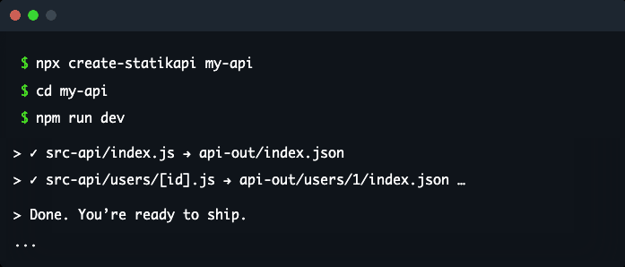

# StatikAPI

<p align="center">
  
</p>

StatikAPI turns filesystem route modules into static JSON endpoints.
Use it when you want a simple route-file workflow, local preview, and a clear deployment path.

## Example File Map

| Source file                                                           | Generated output                                                                                 | Notes                                                                    |
| --------------------------------------------------------------------- | ------------------------------------------------------------------------------------------------ | ------------------------------------------------------------------------ |
| `src-api/index.js`                                                    | `api-out/index.json`                                                                             | Single top-level route.                                                  |
| `src-api/book.js`                                                     | `api-out/book.json`                                                                              | One route file becomes one JSON file.                                    |
| `src-api/users/index.js`                                              | `api-out/users/index.json`                                                                       | Nested route folders stay nested in output.                              |
| `src-api/users/[id].js`                                               | `api-out/users/1.json`, `api-out/users/2.json`, `api-out/users/3.json`                           | Dynamic routes expand to one JSON file per discovered route parameter.   |
| `src-api/docs/[...slug].js`                                           | `api-out/docs/guide.json`, `api-out/docs/api/auth.json`                                          | Catch-all routes expand into one JSON file per discovered path.          |
| `src-api/index.js`, `src-api/users/[id].js`, `src-api/posts/index.js` | `api-out/index.json`, `api-out/users/1.json`, `api-out/users/2.json`, `api-out/posts/index.json` | Multiple source files become multiple generated JSON files in one build. |

## Quick Start

### 1. Scaffold a project

Pick the package manager you already use, then either choose the Cloudflare adapter in the prompt or pass `--template cloudflare-adapter` yourself:

```bash
pnpm dlx create-statikapi my-api
```

```bash
yarn dlx create-statikapi my-api
```

```bash
npx create-statikapi my-api
```

To start with the Cloudflare scaffold directly:

```bash
pnpm dlx create-statikapi my-worker --template cloudflare-adapter
```

### 2. Edit your source files

Add or update route modules in `src-api/`.

```js
// src-api/index.js
export default {
  hello: 'world',
};
```

If you want to adjust the local build output, edit `statikapi.config.js`:

```js
export default {
  srcDir: 'src-api',
  outDir: 'api-out',
};
```

### 3. Run the dev loop

Use the generated project scripts:

```bash
pnpm dev
```

That gives you:

- a watch/build loop
- the preview UI at `/_ui`
- local JSON output refreshes as you edit routes

### 4. Build for deployment

When the project is ready:

```bash
pnpm build
```

That writes the generated API output to `api-out/`.

## Cloudflare Controls

If you want the Cloudflare path, choose the Cloudflare adapter during the interactive scaffold prompt or pass `--template cloudflare-adapter`.
That template gives you a Worker + Static Assets setup with project controls in:

- `wrangler.toml` for Static Assets, R2, KV, and runtime vars
- `.dev.vars` for local dev values and local deploy CLI envs
- `statikapi.config.js` for Cloudflare project defaults and route visibility

The usual flow is:

```bash
pnpm dev
pnpm build
pnpm deploy
```

Use the Cloudflare scaffold when you want:

- public routes served from Static Assets
- private routes behind the Worker
- explicit auth-header control for private access
- a deploy path that matches the Cloudflare contract

## For contributors

If you are working on the StatikAPI repository itself, use these links instead of this quick-start guide:

- [Contributing guide](CONTRIBUTING.md)
- [Docs site content](docs/)
- [Canonical plan notes](.codex/canonical-plan/README.md)

## License

[MIT](LICENSE) © 2025 StatikAPI contributors

See also [SECURITY.md](SECURITY.md) and [CODE_OF_CONDUCT.md](CODE_OF_CONDUCT.md)
